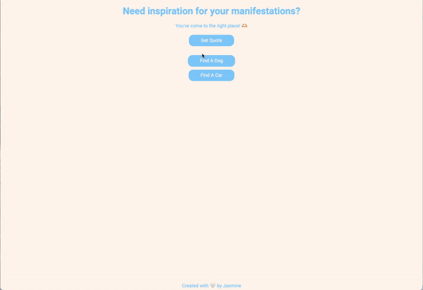

# Manifest Inspiration

Hi! I decided to create a place where you can come to find inspiration to manifest.. whether it's a quote, future dog or dream car.

**Link to project:** https://manifestinspiration.netlify.app/

## How It's Made:

**Tech used:** HTML, CSS, JavaScript, API's

This was created using plain HTML, CSS and vanilla JS. I tested the API's in Postman before implementing in my JavaScript. Testing allowed me to identify the specific properties to fetch from and manipulate into the DOM. The following API's used were:  
💬 [Inspiration API](https://api.goprogram.ai/inspiration/docs/) 
🐶 [The Dog API](https://thedogapi.com/) 
🚗 [Forza API](https://docs.forza-api.tk/) 
 
Build time: 01h02m20s

## Optimizations

I would like to implement a feature where the user can randomize the dogs based on type of breed in case there is a specific one in mind. 
I also used 3 separate functions to fetch the data per API so I'm wondering if it's possible to nest the fetch's or perhaps use another method. 🤔

## Lessons Learned:

I learned how to search for API's, read API documentation, obtain a personalized API key and how that tracks requests per key, test in Postman to help identify specific properties or methods unique to my use case and most importantly, how fun it is to implement API's! I can't wait to discover more API's and the vast set of actions I can perform with one!

## Examples:

Take a look at these couple examples that I have in my own portfolio:

**My Portfolio:** https://jasminesvisionary.com

**Angelhope:** https://github.com/jasminepvo/angelhope

**Mood Journal:** https://github.com/jasminepvo/mood-colors
